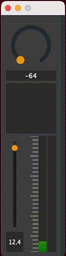

# Juicy Radio


A radio based on `JUCE` and `libmad` and `libcurl`

What you can do:
1. Receive mp3 frames with `curl`.
2. Decode frames to pcm with [`libmad`](http://m.baert.free.fr/contrib/docs/libmad/doxy/html/index.html)
3. Mess around with multithreading wth ring buffers.
3. Pan and adjust volumn.


#### Groceries
1. `juce cmake API`: https://github.com/juce-framework/JUCE/blob/master/docs/CMake%20API.md
```
cmake -B build
cmake --build build
```
---
2. `missing mp3 frames`: https://stackoverflow.com/questions/68580019/increasing-lag-when-transferring-audio-between-streams-with-pulseaudio