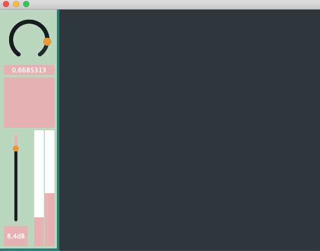

# Juicy Radio


A radio station implemented with `JUCE` and `libmad` and `libcurl`

`libmad`:http://m.baert.free.fr/contrib/docs/libmad/doxy/html/index.html

`juce cmake API`: https://github.com/juce-framework/JUCE/blob/master/docs/CMake%20API.md

`BBC Radio 3`: https://www.bbc.co.uk/sounds/play/live:bbc_radio_three

```
cmake -B build
cmake --build build
```
---
`missing mp3 frames`: https://stackoverflow.com/questions/68580019/increasing-lag-when-transferring-audio-between-streams-with-pulseaudio
